# Penman V2 Analysis

Penman V2 Analysis is a governed financial-analysis and valuation platform for Indian listed companies. It combines Capitaline-oriented ingestion, Penman-Nissim statement reformulation, sector-aware valuation, point-in-time market evidence, immutable analysis runs, and fail-closed review gates in a React and TypeScript application.

The project is designed around one principle: a valuation is useful only when a reviewer can trace the inputs, transformations, assumptions, model eligibility, and confidence level that produced it.

> [!IMPORTANT]
> Repository-level platform implementation is complete and validated, but a production deployment is not created merely by cloning the code. Managed PostgreSQL and private Blob credentials, an OIDC identity tenant, reviewed issuer sidecars, historical calibration evidence, independent model approvals, and an exercised backup/restore drill are external activation prerequisites. See [Production platform activation](./docs/production-platform-activation.md).

## What the platform does

- Ingests Capitaline ZIPs, Screener tabular data, raw JSON, XBRL XML, and structured manual entries.
- Converts source observations into canonical, lineage-bearing facts and deterministic analysis inputs.
- Detects the analytical family and routes industrial companies, banks, NBFCs, insurers, utilities, telecoms, cyclicals, conglomerates, and loss-makers through appropriate governed paths.
- Reformulates industrial statements into operating and financing activities using the Penman-Nissim framework.
- Computes ratios, quality diagnostics, anomalies, reconciliation residuals, distress signals, cyclicality, structural breaks, and business-model indicators.
- Runs intrinsic, relative, market-implied, sector-native, and diagnostic valuation models without double-counting correlated evidence.
- Produces scenario forecasts, reverse DCFs, Monte Carlo analysis, peer comparisons, investment theses, audit snapshots, and Excel/PDF reporting surfaces.
- Applies one shared trust envelope across analysis and reporting tabs so a polished output cannot claim more confidence than its underlying evidence supports.
- Persists immutable, content-addressed AnalysisRuns through authenticated, workspace-scoped platform services.
- Provides local filesystem persistence for workstation use and PostgreSQL plus private object storage adapters for production activation.

## Current implementation profile

| Area | Current contract |
|---|---|
| Built-in company registry | 33 companies with consolidated and standalone ZIP packages |
| Traceability schema | `2026-06-traceability-v20` |
| Valuation catalog | 44 definitions; lifecycle, family, independence group, integration state, and implementation are explicit |
| Production model definitions | 21 intrinsic or relative definitions across 11 independent production evidence groups |
| Frontend | React 19, TypeScript 5.9, Vite 7, Tailwind CSS 4 |
| Local API | Express 5 on `127.0.0.1:3001` |
| Production API | Vercel serverless functions with a guarded 12-function Hobby-plan budget |
| Durable platform | PostgreSQL-compatible repositories plus private Vercel Blob object storage |
| Test stack | Vitest 4 and Playwright |
| Runtime | Node.js `^20.19.0` or `>=22.12.0`; npm `>=10` |

The generated [Valuation Model Catalog](./docs/generated/valuation-model-catalog.md) is the authoritative inventory. Catalog presence never implies that a model ran: runtime eligibility, finite results, evidence coverage, and lifecycle state determine whether a model contributes to a valuation.

## Architecture

```mermaid
flowchart LR
    A[Capitaline / Screener / JSON / XBRL / Manual] --> B[Source adapters and parser diagnostics]
    B --> C[Canonical facts and per-number lineage]
    C --> D[Scope and analysis-family routing]
    D --> E1[Industrial Penman-Nissim pipeline]
    D --> E2[Bank / NBFC / insurance pipeline]
    E1 --> F[Quality, reconciliation, anomaly and economic gates]
    E2 --> F
    F --> G[Forecasts, valuation models and sector cases]
    G --> H[Evidence-weighted synthesis]
    H --> I[Shared traceability envelope]
    I --> J[UI, workbook, thesis, peer and audit surfaces]
    I --> K[Immutable AnalysisRun and content-addressed artifacts]
    K --> L[Local filesystem or PostgreSQL + private object storage]
```



### Core processing flow

1. **Ingestion** - Source adapters parse the input and emit `RawPeriodData[]`, parser diagnostics, artifact identities, and canonical fact bundles.
2. **Scope resolution** - The engine evaluates company type and analytical family before valuation. Unsupported or ambiguous scope fails closed.
3. **Reformulation** - Industrial data is split into operating and financing activities; financial institutions use their own balance-sheet and earnings logic.
4. **Quality and plausibility** - Reconciliation, mapping coverage, concept identity, unusual-item classification, anomaly detection, ratio sanity, and economic checks determine the level of trust earned.
5. **Forecast and valuation** - Eligible models consume a unified analysis window, governed assumptions, structurally consistent capital costs, and point-in-time market evidence.
6. **Synthesis** - Outputs are grouped by independent evidence family before aggregation. Model count alone cannot manufacture confidence.
7. **Publication and persistence** - The shared traceability envelope is used by the UI, exports, audit snapshots, immutable runs, and portfolio comparison.

The browser orchestration lives in [`src/app/AppShell.tsx`](./src/app/AppShell.tsx), the primary compute entry is [`src/engine/pipeline.ts`](./src/engine/pipeline.ts), and the production application boundary is [`src/platform/analysisPlatformService.ts`](./src/platform/analysisPlatformService.ts).

## The rigor ladder

Every run progresses monotonically through five review levels. A failed earlier gate prevents later levels from clearing.

| Level | What must be true |
|---|---|
| `syntactically-valid` | Parser fidelity clears the minimum threshold and no engine error is present. |
| `structurally-reconciled` | Recast data exists, scope is supported, blockers are absent, and required balance-sheet, income-statement, cash-flow, debt-flow, distribution, and share-capital residuals stay within policy thresholds. |
| `economically-plausible` | Structural reconciliation has passed and economic sanity checks do not identify a blocking state. |
| `valuation-eligible` | The run is not guarded and all model, evidence, capital-cost, point-in-time, and valuation policies required by the selected family pass. |
| `production-ready` | The analysis status, evidence package, and publication controls satisfy the full production policy. |

The shared `AnalysisTraceabilityEnvelope` records parser fidelity, mapping coverage, reconciliation, concept identity, economic sanity, lineage references, analytical depth, anti-tautology checks, policy versions, and the achieved and pending rigor levels. Persisted older envelopes are handled by [`src/lib/envelopeMigrations.ts`](./src/lib/envelopeMigrations.ts).

For the detailed checks and residual identities, read [Analysis Rigor Ladder](./docs/analysis-rigor-ladder.md), [Financial Model Rigor Plan](./docs/financial-model-rigor-plan.md), and [Rigor Knowledge Base](./RIGOR_KNOWLEDGE_BASE.md).

## Valuation coverage

The catalog separates production, experimental, diagnostic, intrinsic, relative, market-implied, and aggregator models. Major implemented families include:

| Family | Representative coverage |
|---|---|
| Industrial accrual valuation | Residual income, residual operating income, AEG/DDM/FCFE/FCFF cross-checks |
| Industrial cash valuation | Cash-statement FCFF DCF, owner-earnings DCF, Graham-Dodd EPV |
| Market-implied analysis | Reverse DCF, reverse-DCF Monte Carlo, loss-maker reverse DCF |
| Relative valuation | Peer-relative synthesis, historical multiples, EV/EBITDA, loss-maker revenue multiples |
| Conglomerate valuation | Segment SOTP with governed contribution and anti-double-counting controls |
| Banks and NBFCs | Equity residual income, justified P/B, sustainable DDM, scenario bundles, P/AUM, ROA/leverage residual income |
| Insurance | Embedded-value and VNB appraisal when the required evidence is present |
| Sector-native cases | Cyclical mid-cycle FCFF, retail unit economics, telecom subscriber economics, utility RAB/DDM, NBFC funding economics |
| Advanced models | Governed R&D real options; ESG, FX, lease, and other diagnostics with explicit promotion state |

Capital cost is resolved centrally. `ke` and structurally derived `kw` carry provenance, and downstream modules consume the same governed result instead of independently inventing discount rates.

## Quick start

### Prerequisites

- Node.js `^20.19.0` or `>=22.12.0`
- npm 10 or newer
- Git
- A modern browser

Python is optional and is only needed when regenerating annual-report quality sidecars.

### Install and run

```powershell
git clone https://github.com/rajesh180675/penman-v2-analysis-vercel.git penman-v2-analysis
Set-Location penman-v2-analysis
npm ci
npm run dev:local
```

Open [http://localhost:5173](http://localhost:5173). The command starts:

- Vite on `http://localhost:5173`
- the local Express API on `http://127.0.0.1:3001`
- a pre-start registry check for all built-in companies

The default local workflow requires no API key. The Vite frontend automatically supplies the local CSRF header expected by the Express server.

Windows users can also run `start-local.bat`. The shell equivalent is `start-local.sh`.

### Load a built-in company directly

Select a company from the Data tab, or use the audited TCS deep link:

```text
http://localhost:5173/?rf=7.00&erp=6.00&tab=upload&dark=0&company=TCS
```

`company=TCS` is a ticker lookup. The registry resolves it to the on-disk folder `public/data/companies/Tata Consultancy Services Ltd/` and loads the consolidated and standalone ZIPs. The requested tab is resolved after ingestion according to the detected analysis family and trust state.

## Input modes

| Mode | Expected input | Notes |
|---|---|---|
| Capitaline ZIP | ZIP containing balance sheet, profit and loss, and cash-flow XLS exports | Recommended. Consolidated and standalone data must be separate ZIPs. |
| Screener Paste | Tab-delimited Screener export | Parsed with source-native diagnostics. |
| Raw JSON | Array of canonical raw-period records | Metric values must be finite numbers or `null`; invalid types fail loudly. |
| XBRL XML | XBRL instance XML | Context and mapped-fact diagnostics feed parser fidelity. |
| Manual Wizard | Structured five-step entry | Intended for bounded manual datasets and explicit provenance. |

For banks, NBFCs, and insurers, an optional `quality_indicators.json` sidecar supplies measures that ordinary Capitaline statement exports do not reliably contain. Consolidated plus standalone data enables the Scope tab's subsidiary-contribution analysis.

## Built-in company data

The repository ships a generated registry and deterministic ZIP packages under:

```text
public/data/companies/
|-- companies-metadata.json   # single source of company metadata
|-- registry.json             # generated application registry
|-- <Company Folder>/
|   |-- <Company Folder>.zip  # consolidated package
|   |-- standalone.zip        # standalone package
|   `-- quality_indicators.json / sidecars, when applicable
```

`companies-metadata.json` is the metadata source of truth. `sync-companies.cjs` walks the folders, builds byte-stable ZIPs from available XLS sources, and regenerates `registry.json` deterministically.

### Refresh an existing company

```powershell
npm run refresh -- "Bajaj Finance"
npm run refresh -- --dry-run "Bajaj Finance"
npm run refresh -- --skip-extract "Bajaj Finance"
```

The refresh wrapper selects the bank, NBFC, insurance, or general pipeline from registry metadata and then synchronizes the company packages.

### Add or update company files

1. Add or update the company folder under `public/data/companies/`.
2. Add or correct its entry in `companies-metadata.json`.
3. Run `node sync-companies.cjs`.
4. Run `npx tsx scripts/validate-registry.ts`.
5. Start the app and load the company from the library.
6. If production data changed, upload the regenerated packages with `scripts/upload-to-blob.mjs` using a secret `BLOB_READ_WRITE_TOKEN`.

See [Operations Manual - Adding a New Company](./docs/OPERATIONS_MANUAL.md#7-adding-a-new-company--end-to-end) for file naming, quality-sidecar generation, and Blob publishing.

## User interface

The application exposes 20 routed tabs. Tabs that interpret analytical results consume the shared trust state rather than constructing separate confidence claims.

| Group | Tabs | Purpose |
|---|---|---|
| Data & Input | Data, Dashboard, Watchlist, Workspace, Runs | Ingestion, company overview, saved research, portfolio navigation, and run inspection |
| Analysis | Statements, Ratios, Quality, Scope, Atlas, Business Model, Forecast | Recast statements, decomposition, diagnostics, scope comparison, filing atlas, business economics, and governed scenarios |
| Valuation | Valuation, Bank | Industrial command center and financial-institution analysis |
| Peers | Comparison | Trust-filtered peer analysis and immutable-run-backed portfolio allocation |
| Export | Report, Thesis | Academic/workbook reporting and investment-thesis output |
| Advanced | Regression, V3 Analytics, Debug | Golden-baseline comparison, advanced analytics, parser diagnostics, residuals, and raw trace inspection |

For a detailed operating walkthrough, use the [Local User Manual](./LOCAL_USER_MANUAL.md).

## Local persistence and APIs

### Local mode

The local Express service binds to `127.0.0.1` by default and stores server-side state beneath:

```text
~/.penman-data/
|-- audit/
|-- blackboard/
`-- research/
```

Set `PENMAN_DATA_DIR` to relocate this store. Browser-side registries and workspace state are also persisted locally and synchronize through the research API where configured.

Local route families are:

- `/api/health` - local service status
- `/api/market-data/snapshot` - NSE, Yahoo, Alpha Vantage, Upstox, manual, or offline snapshot resolution
- `/api/audit/*` - events, uploads, binary artifacts, runs, retention, monitoring, and inspection
- `/api/research/*` - company profiles, analyses, journals, filings, valuations, alerts, and comparison snapshots
- `/api/blackboard` - small session-scoped state

All local `/api/*` calls require `x-penman-local: 1`. If `LOCAL_AUDIT_TOKEN` is configured, callers must also provide `x-audit-token`. The browser client handles both automatically.

### Production mode

Vercel serves the static frontend and the functions under `api/`. Research and audit payloads use Vercel Blob. The production valuation platform additionally supplies:

- authenticated OIDC sessions and workspace RBAC;
- PostgreSQL repositories and migration checksums;
- immutable runs, idempotent operations, audit events, publication locks, memberships, scenario vintages, and retention holds;
- private content-addressed object storage;
- server-side governance resolution for sector sidecars and advanced-model approvals;
- authenticated backup, restore-drill, outbox, and health operations.

Production routes fail closed when required credentials or authorization are absent.

## Configuration

The committed [`.env.local.example`](./.env.local.example) documents every supported setting. Copy it only when you need to override defaults or activate optional services:

```powershell
Copy-Item .env.local.example .env.local
```

Do not commit `.env.local`, `.env.platform.local`, tokens, database URLs, or HMAC material.

Important configuration groups are:

| Group | Representative variables | When needed |
|---|---|---|
| Local server | `LOCAL_SERVER_PORT`, `LOCAL_AUDIT_TOKEN`, `PENMAN_DATA_DIR`, `LOCAL_JSON_BODY_LIMIT`, `RESEARCH_JSON_BODY_LIMIT`, `LOCAL_AUDIT_BLOB_LIMIT` | Local overrides and protected API testing |
| Market data | `MARKET_DATA_PROVIDER`, `ALPHAVANTAGE_API_KEY`, `UPSTOX_ACCESS_TOKEN` | Optional vendor-backed snapshots; NSE needs no key |
| Audit and research | `BLOB_READ_WRITE_TOKEN`, `AUDIT_ADMIN_TOKEN`, `AUDIT_ADMIN_WRITE_TOKEN`, `RESEARCH_REQUIRE_READ_AUTH`, `RESEARCH_REQUIRE_WRITE_AUTH` | Production persistence and protected reads/writes |
| Platform database and identity | `PLATFORM_DATABASE_URL`, pool limits, `PLATFORM_SESSION_ISSUER`, `PLATFORM_SESSION_AUDIENCE` | Production platform runtime |
| Backup and delivery | backup HMAC, outbox webhook/HMAC, health token/scope, `CRON_SECRET` | Production operations |
| Browser rigor gates | `VITE_RIGOR_CONCEPT_IDENTITY_BLOCK`, `VITE_RIGOR_ECONOMIC_SANITY_BLOCK`, `VITE_RIGOR_TERMINAL_ELIGIBILITY_BLOCK`, `VITE_RIGOR_RESIDUAL_SCORE_DOWNGRADE` | Emergency kill switches; enabled by default |
| Browser audit capture | `VITE_AUDIT_CAPTURE_ENABLED`, content class, retention and size limits | Client-side audit policy |

Rigor flags are disabled only by the literal value `false` (case-insensitive). Disabling one makes its contribution visible without allowing that check to hard-gate the ladder; use this as an operational rollback mechanism, not as a substitute for fixing evidence.

## Commands

### Daily development

| Command | Purpose |
|---|---|
| `npm run dev:local` | Validate the registry, start Vite and the local API |
| `npm run dev` | Same combined development stack |
| `npm run server` | Start only the local Express API |
| `npm run preview` | Preview an existing production build |
| `npm run refresh -- "Company"` | Run the company-type-aware refresh workflow |

### Validation

| Command | Purpose |
|---|---|
| `npm run typecheck` | Type-check application code |
| `npm run typecheck:scripts` | Type-check scripts and server tooling |
| `npm test` | Run the complete Vitest suite |
| `npm test -- <path>` | Run one test file |
| `npm run test:golden` | Run golden-company and release-gate cases |
| `npm run test:audit` | Run all company-audit shards |
| `npm run test:e2e` | Run Playwright end-to-end tests |
| `npm run test:e2e:tcs-audit` | Run the TCS deep-link audit acceptance case |
| `npm run build` | Validate company packages and build the Vite application |
| `npm run validate` | Type checks, static budgets, transport integration, sharded tests, build, and bundle budget |
| `npm run validate:release` | Golden tests, full validation, and all-company audit |

### Static governance checks

| Command | Contract enforced |
|---|---|
| `npm run lint:any` | TypeScript `any` budget |
| `npm run lint:doc-schema` | Documentation and traceability schema pin |
| `npm run lint:vercel-functions` | Vercel Hobby function budget (`12/12` maximum) |
| `npm run lint:model-catalog` | Generated model catalog freshness |
| `npm run lint:audit-snapshot` | Real TCS audit transport budget and artifact path |
| `npm run lint:bundle` | Built JavaScript gzip budgets |

### Production platform operations

```powershell
npm run platform:ops -- generate-secrets .env.platform.local
npm run platform:ops -- preflight runtime
npm run platform:ops -- preflight operations
npm run platform:preflight

npm run platform:ops -- migrate
npm run platform:ops -- bootstrap-admin <organizationId> <workspaceId> <principalId>
npm run platform:ops -- probe <organizationId> <workspaceId>
npm run platform:ops -- backup <organizationId> <workspaceId>
npm run platform:ops -- restore-drill <organizationId> <workspaceId>
```

The secret generator refuses to overwrite an existing file and does not print generated secret values. Migration, probe, backup, restore, and bootstrap commands require configured production adapters.

## Testing and release gates

GitHub Actions divides validation into independent gates:

- type safety, static budgets, audit transport, production build, and bundle size;
- three Vitest unit shards;
- golden valuation cases;
- three all-company audit shards;
- the TCS deep-link Playwright acceptance test;
- aggregate `release-gate` and protected-branch `validate` contexts.

Tests cover parsers, fuzzed source inputs, canonical facts, lineage, reconciliation, cost of capital, forecast governance, model execution, immutable runs, durable repositories, tenancy, security, backup/restore, Vercel routes, components, real-company goldens, and registry parity.

When changing a rigor contract:

1. Identify the missing exit criterion in [Financial Model Rigor Plan](./docs/financial-model-rigor-plan.md).
2. Add or update the smallest contract-focused test first.
3. Implement the change end to end across engine, traceability, persistence, and affected surfaces.
4. Run the focused test, then `npm run validate`.
5. Use `npm run validate:release` for model, company-data, or release-policy changes.

## Deployment

The repository's [`vercel.json`](./vercel.json) configures:

- `npm ci` installation;
- `npm run build` as the build command;
- `dist/` as the static output;
- security headers and a restrictive content-security policy;
- consolidated platform and cron catch-all functions;
- daily audit monitoring and pruning;
- daily platform outbox and backup jobs;
- a monthly isolated restore drill.

Deploying the frontend is straightforward, but activating the production platform is deliberately stricter:

1. Provision managed PostgreSQL and private Vercel Blob.
2. Configure HTTPS OIDC issuer/audience and signed organization identity.
3. Generate and store backup, outbox, health, and cron secrets.
4. Run runtime, operations, and release preflight profiles.
5. Apply migrations and bootstrap the first administrator only in an empty workspace.
6. Run live SQL/object-store probes, backup, and restore drill.
7. Admit reviewed calibration observations, issuer sidecars, goldens, and independent approvals.
8. Run `npm run validate:release` and the staging TCS acceptance path.
9. Enable the platform by workspace feature flag after health is ready.

Read [Deploying to Vercel](./README_DEPLOY_VERCEL.md), [Production Platform Activation](./docs/production-platform-activation.md), and [Backup Runbook](./docs/BACKUP_RUNBOOK.md) before enabling protected production features.

Vercel Hobby accepts one daily execution per configured cron. If prompt outbox delivery is required, use Vercel Pro with a five-minute schedule or an authenticated external scheduler.

## Security and governance

- Workspace identity is derived from verified server sessions, not client-supplied organization identifiers.
- RBAC and distributed rate limits are enforced before platform operations.
- Local APIs bind to loopback by default and require a custom CSRF header.
- Production audit, research, cron, platform, and health routes fail closed when required secrets are absent.
- Run artifacts are content-addressed and hash-verified before creation, finalization, or publication locking.
- Locked-run evidence receives retention holds and cannot be silently purged.
- Point-in-time validation rejects future financial periods and market or calibration evidence newer than run `asOf`.
- Advanced-model promotion requires implementation evidence, real-issuer cases, lineage, coverage, calibration or an approved exemption, and two distinct reviewers.
- Backup packages use SHA-256 payload hashes and HMAC-SHA256 authentication; restore verifies exact manifest/payload closure before atomic commit.
- Secrets and sensitive financial documents must never be committed to the repository.

This software is an analytical and research system. It does not replace independent investment judgment, accounting review, actuarial review, or regulated financial advice.

## Project structure

```text
.
|-- api/                         # Vercel audit, research, market, platform, and cron functions
|-- docs/                        # Architecture, ADRs, rigor plans, runbooks, and implementation reports
|-- e2e/                         # Playwright acceptance tests
|-- public/data/companies/       # Built-in company packages and generated registry
|-- scripts/                     # Registry, audit, catalog, validation, load, and platform operations
|-- server/                      # Local Express API and production runtime adapters
|-- src/
|   |-- app/                     # Application shell, tabs, deep links, workspace and run coordination
|   |-- components/              # Reports, panels, dashboards, inspectors, and data-entry UI
|   |-- engine/                  # Parsers, facts, recast, gates, forecasts, valuation, and synthesis
|   |-- lib/                     # Audit transport, persistence, migrations, registry and shared clients
|   `-- platform/                # Immutable runs, security, repositories, governance, and operations
|-- sync-companies.cjs           # Deterministic company package and registry compiler
|-- vercel.json                  # Deployment, headers, functions, and schedules
`-- package.json                 # Runtime requirements and command catalog
```

Important architecture references:

- [Production Valuation Platform Implementation Report](./docs/architecture/plans/2026-07-13-production-valuation-platform-implementation-report.md)
- [Principal Architecture Greenfield Design](./docs/architecture/plans/2026-07-10-principal-architecture-valuation-platform-greenfield-design.md)
- [Architecture Decision Records](./docs/architecture/decisions/README.md)
- [Generated Valuation Model Catalog](./docs/generated/valuation-model-catalog.md)
- [Operations Manual](./docs/OPERATIONS_MANUAL.md)

## Troubleshooting

### A built-in company still shows “upload data”

1. Confirm both the folder and packages exist under `public/data/companies/<folder>/`.
2. Run `npx tsx scripts/validate-registry.ts`; it should report all 33 companies and matching folders/ZIPs.
3. Run `node sync-companies.cjs`; on a clean registry it should report no write needed.
4. Restart `npm run dev:local` and hard-refresh the browser.
5. Use the registry ticker in the URL, not necessarily the folder name. For TCS use `company=TCS`; the folder is `Tata Consultancy Services Ltd`.
6. Inspect the browser network panel for `registry.json`, the consolidated ZIP, and `standalone.zip`. A 404 usually means folder/registry casing drift or a stale package URL.

### `413 Payload Too Large`

Current audit capture sends large binary artifacts through the dedicated blob path instead of embedding them in `/api/audit/events`. If a current checkout still receives 413:

- record the request path and `Content-Length` from the server log;
- keep ordinary JSON events small and persist large files through the audit blob/upload endpoints;
- use `RESEARCH_JSON_BODY_LIMIT` only for intentionally large multi-company research snapshots;
- use `LOCAL_AUDIT_BLOB_LIMIT` only for intentional audit binary uploads;
- use `LOCAL_JSON_BODY_LIMIT` only when an ordinary JSON route genuinely requires a larger bounded payload.

Do not solve an event-payload problem by setting an unlimited global body size.

### The local API appears offline

- Confirm `npm run dev:local` shows both `vite` and `api` processes.
- Open `http://localhost:5173`, not port 3001.
- Check that another process is not using ports 5173 or 3001.
- If `LOCAL_SERVER_PORT` is changed, update the Vite proxy target or return it to 3001.

### A valuation or sector case is blocked

Open Debug and Runs. A block can be the correct result when scope, parser fidelity, reconciliation, sidecar evidence, history, market timestamps, calibration, or model promotion does not satisfy policy. Do not bypass the gate until the missing evidence contract is understood.

### Registry or ZIP files change on every run

Stop the dev server, run `node sync-companies.cjs` twice, and inspect the second run. It must be a no-op. Case-sensitive metadata/folder drift and noncanonical source names are the common causes.

More operating issues are documented in [Operations Manual - Troubleshooting](./docs/OPERATIONS_MANUAL.md#14-troubleshooting--known-gotchas).

## License

Licensed under the [MIT License](./LICENSE). Copyright (c) 2026 rajesh180675.
