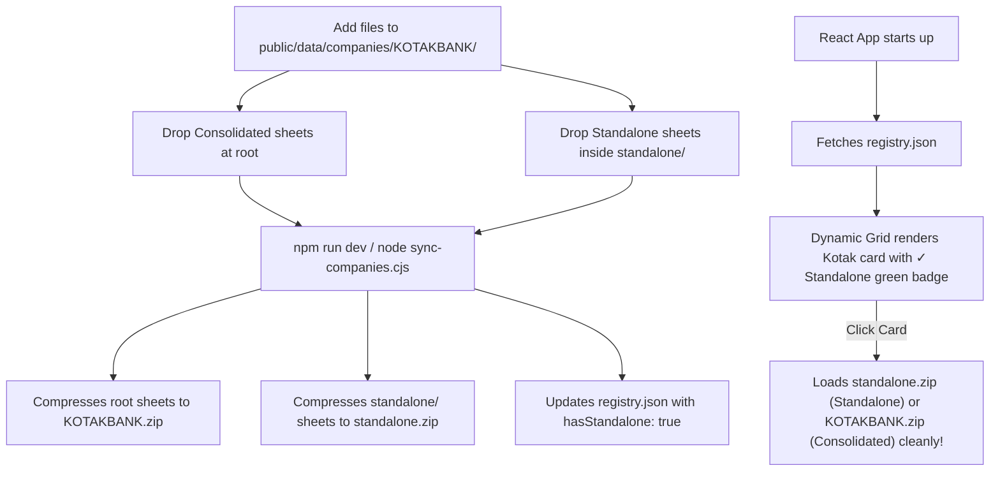

# 📖 User Manual: Preloading New Companies & Statement Datasets

This manual provides detailed, step-by-step instructions on how to preload any new company (or add missing consolidated/standalone financial statements for existing companies like Kotak and SBI) so that they are automatically packaged, indexed, and displayed in the **Company Library UI**.

---

## 🏗️ 1. Directory Structure Blueprint

To preload a company, you only need to copy the raw Capitaline `.xls` spreadsheet exports into a folder inside `public/data/companies/`. The background sync engine will handle the zipping and indexing.

Ensure your directories match the following structural layout:

```text
public/data/companies/
  ├── KOTAKBANK/                         <-- Target Company Folder Name (Unique ID)
  │    ├── BalanceSheetINDAS_.xls        <-- Consolidated Balance Sheet
  │    ├── ProfitLossINDAS_.xls          <-- Consolidated Profit & Loss / Income Sheet
  │    ├── CashFlow_.xls                 <-- Consolidated Cash Flow Statement
  │    │
  │    ├── standalone/                   <-- Standalone statements subfolder (Strictly Lowercase!)
  │    │    ├── BalanceSheetINDAS_.xls   <-- Standalone Balance Sheet
  │    │    ├── ProfitLossINDAS_.xls     <-- Standalone Profit & Loss
  │    │    └── CashFlow_.xls            <-- Standalone Cash Flow Statement
  │    │
  │    ├── quality_indicators.json       <-- Pre-calculated bank/NBFC sidecar ratios (AR PDFs)
  │    └── metadata.json                 <-- Optional custom UI configurations (described below)
```

> [!IMPORTANT]
> **Why separate folder names?** 
> Never mix Consolidated and Standalone files in the same folder. Standardizing Standalone files inside a subfolder named `standalone/` ensures that metric keys do not collide or overwrite each other during unzipping.

---

## 📋 2. Step-by-Step Preloading Guide

Follow these exact steps to load a company:

### Step A: Export Capitaline Spreadsheet Files
Export the financial statements from Capitaline. Keep their standard sheet structures. Ensure they are saved as `.xls` files.

### Step B: Create the Company Folder
1. Open `public/data/companies/` in your file explorer.
2. Create a new folder named after your company (e.g. `INFOSYS` or use the existing `KOTAKBANK` / `SBIN` folders).
3. **Consolidated Files**: Paste your consolidated P&L, Balance Sheet, and Cash Flow `.xls` files directly into the root of this company folder.

### Step C: Create the Standalone Folder (Optional)
If standalone statements are available and you want to offer both options in the UI:
1. Inside your company folder, create a new subfolder named **exactly** `standalone` (all lowercase).
2. Paste the standalone P&L, Balance Sheet, and Cash Flow `.xls` files inside this `standalone/` subfolder.

### Step D: Add Custom Metadata (Optional)
By default, the sync engine will auto-detect company properties using smart fallbacks (e.g. Title-casing the folder name, uppercase tickers, generic sector names, and matching emojis based on keywords like "bank" or "power").

If you want to customize how the company card appears in the UI, create a file named `metadata.json` directly inside the company folder:

```json
{
  "name": "Kotak Mahindra Bank",
  "ticker": "KOTAKBANK",
  "sector": "Banking (Private)",
  "type": "bank",
  "description": "Premium private sector bank with a conservative loan book and high asset quality.",
  "emoji": "🏦",
  "showcaseFor": "Dynamic standalone/consolidated transition with GNPA analysis"
}
```

#### Valid values for `"type"` (maps to color-coded badges in the UI):
| Type | Badge Color | Target Issuers |
| :--- | :--- | :--- |
| `"industrial"` | Blue | Standard manufacturing / services |
| `"bank"` | Green | Commercial banks (e.g. HDFC, ICICI, Kotak, SBI) |
| `"nbfc"` | Green | Non-banking financial companies (e.g. Bajaj Finance) |
| `"insurance"` | Cyan | Insurance providers (e.g. LIC) |
| `"utility"` | Amber | Regulated utilities (e.g. Power Grid) |
| `"it-services"` | Violet | Software / IT solutions (e.g. TCS) |
| `"cyclical"` | Orange | Heavy cyclical metals/resources (e.g. Tata Steel) |
| `"loss-maker"` | Red | Non-profitable high-growth (e.g. Paytm) |
| `"conglomerate"` | Indigo | Diversified giants (e.g. ITC, Reliance) |

---

## ⚡ 3. Running the Automatic Syncer

Once you have dropped your files in the directory, you do not need to run any manual zip utilities. The registry syncer is fully integrated into the local development cycle.

### Method A: Automated Run (Standard Development)
Simply start your local development server as usual:
```bash
npm run dev
```
Or build the production application:
```bash
npm run build
```
The script will **automatically** run `node sync-companies.cjs` in the background before spinning up Vite. You will see output logs confirming that:
* Root `.xls` files are compiled into `[folderName].zip`.
* Standalone `.xls` files are compiled into `standalone.zip`.
* `public/data/companies/registry.json` is rebuilt with the new configurations and standalone flags.

### Method B: Manual Run
If you just want to update the ZIPs and catalog index without launching the server:
```bash
node sync-companies.cjs
```

---

## 🔍 4. Ingestion Registry Flow Diagram



---

## 🛠️ 5. Troubleshooting & Tips

> [!TIP]
> **Case Sensitivity Matters:** Ensure the standalone subfolder is named `standalone` in strictly lowercase. Capital letters (like `Standalone/` or `STANDALONE/`) can cause packaging issues on case-sensitive deployment servers like Vercel or Linux staging environments.

> [!WARNING]
> **File Names:** Standard Capitaline filenames (e.g. `BalanceSheetINDAS_.xls`, `ProfitLossINDAS_.xls`, `CashFlow_.xls`) must be preserved. The analyzer uses regex patterns on filenames to align statements dynamically; changing the names to arbitrary text can disrupt standard aliases.

> [!NOTE]
> **Data Integrity:** The automated sync script uses premium Node buffer-level compression (`compression: 'DEFLATE', level: 9`) which yields a **97% compression ratio** on Capitaline XML-XLS tables, reducing 12MB of uncompressed statements to ~300KB! This ensures that your Company Library launches instantaneously for your users.
